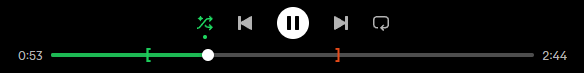
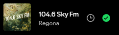
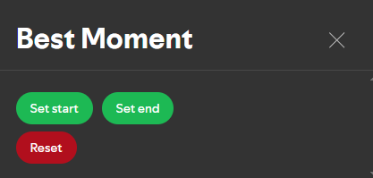

# Spicetify Best Moment

  

## Description

Best Moment is an extension for Spicetify that will let you listen to the selected segment of the track.
It saves data about boundaries in local storage and will draw them on the playbar.

## Installation

You can install this extension from the Spicetify Marketplace.

## Usage

Once installed, you will see a 🕒clock icon next to the track name, like this:

But before you click on it, determine the boundaries beyond which the playback will not go.
Move the play slider to one of the boundaries and click on the clock icon:

You will see 3 buttons:
1. **Set start**: This will set the start boundary to be equal to the current progress of the track.
2. **Set end**: This will set the end boundary to be equal to the current progress of the track.
3. **Clear**: This will clear all boundaries and remove them from the local storage and the playbar.

Now, if you set both start and end boundaries, the player will start from the start boundary and end at the end boundary.
Simple as that.

If you set only one boundary:
- **Only start**: The player will start from the start boundary and end at the end of the track.
- **Only end**: The player will start from the start of the track and end at the end boundary.

## Contributing

Contributions, issues, bug reports, feature requests and suggestions are always welcome.
If you want to contribute, open the [issue](https://github.com/MLGRussianXP/spicetify-best-moment/issues).
